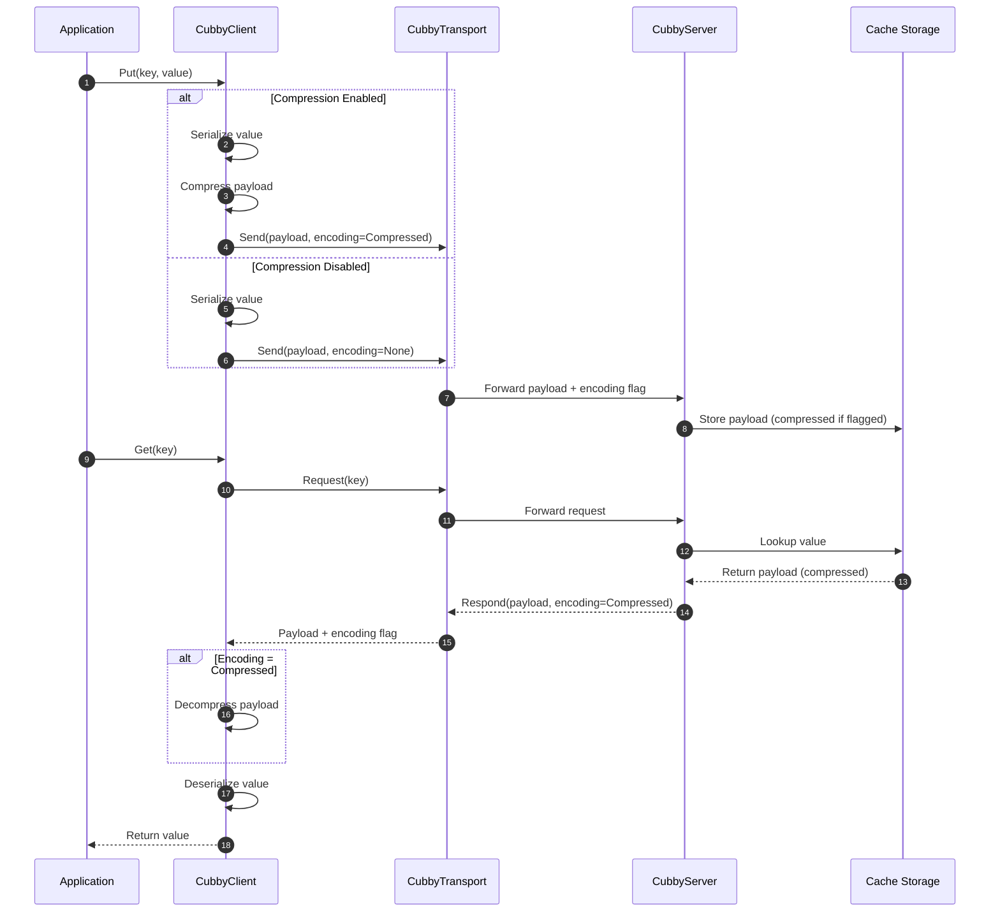
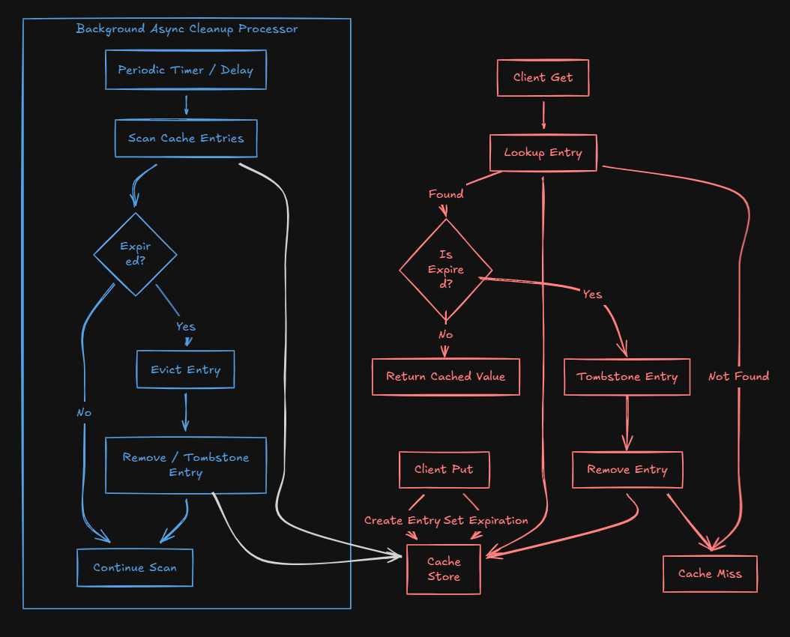

 
[](https://github.com/Scribbly-Fun/Scribbly.Cubby/issues)


[](https://github.com/Scribbly-Fun/Scribbly.Cubby/actions/workflows/dotnet-test.yml)


# Scribbly Cubby

Cubby is a 'choose your own adventure' cross platform native AOT .net distributed cache application. 

> [!Note]
> Still in initial development, there may be several incorrect statements in the readme


## Table of Contents
<!-- TOC -->
* [Cubby Host](#cubby-host)
  * [AOT](#aot)
  * [Docker](#docker)
  * [Library](#library)
  * [Transports](#transports)
* [Cubby Client](#cubby-client)
  * [Transports](#transports-1)
  * [Serializers](#serializers)
  * [Compression](#compression)
* [Cache Store](#cache-store)
* [Benchmarks](#benchmarks)
<!-- TOC -->

## Example

Below is a brief snip of code to get you started before reading more.

```shell
docker run -p 5000:8080 scribbly/cubby:***
```

```csharp
var builder = WebApplication.CreateSlimBuilder(args);

builder.Services
    .AddCubbyClient(ops =>
    {
        // Set the server's URL 
        ops.Host = "https://localhost:5000"
        
        // Configure the client scope, defaults to a Singleton
        ops.Lifetime = ServiceLifetime.Singleton;
        
        // Setup a custom serializer configuration
        ops.AddSystemTextSerializer(ops =>
        {
            ops.TypeInfoResolverChain.Insert(0, ItemJsonContext.Default);
        });
    })
    // Register communication transport
    .WithCubbyHttpClient() 
    .WithCubbyGrpcClient();

var app = builder.Build();
app.Run();
```

> And thats it, but there's so much more. Sure cubby is published as a docker image for you, 
however it can also be run from within an existing dotnet application, as a standalone AOT binary, and from an Aspire apphost. 

# Cubby Host

The cubby host is a native AOT application that can be hosted on bare metal or containers.  Cubby host can also be used as a
nuget package and executed from within an existing application.  

## AOT

To create a Native AOT build of cubby follow the build steps below.

```shell
cd ./app/Scribbly.Cubby.Host
```

```shell
dotnet publish ./Scribbly.Cubby.Host.csproj -r win-x64 -c Release -o ../../artifacts/publish
```
```shell
../../artifacts/publish/Scribbly.Cubby.Host.exe
```

>[!Note]
> Compiled binaries for a few platforms (Window x64, Linux x64) will be provided eventually.
> Expect to see these on the github releases soon.

## Docker

Simply pull our container using docker pull.  By default the container will run with the Cubby HTTP and gPRC transports.

https://hub.docker.com/repository/docker/scribbly/cubby/general
``docker pull scribbly/cubby:***``

### Environment Variable

> [!Note]
> Long term you will be able to start the container with the transport(s) specified using an environment variable
> something like: CUBBY__TRANSPORT:tcp http grpc
> Currently the container will start with gRPC and HTTP transports.
> gRPC will not include a SSL will need to be managed from outside the container

| Name                     | Purpose                                                  | Values                                                 | 
|--------------------------|----------------------------------------------------------|--------------------------------------------------------|
| CUBBY__STORE             | Changes the cubby internal store                         | Sharded, Concurrent, LockFree                          |
| CUBBY__CAPACITY          | Sets the storage capacity for the cache                  | 0 - None or 1 - XXXX                                   |
| CUBBY__CLEANUP__STRATEGY | Sets the cache expiration cleanup strategy               | Disabled, Hourly, Random, Aggressive, Duration, Manual |
| CUBBY__CLEANUP__DELAY    | The time between cleanups when using a Duration strategy | 00:00:00 - HH:MM:SS:MS                                 |
| LOGGING__LOGLEVEL        | A log level used for all standard out messages           | Scribbly.Cubby : Trace, Information, etc               |
| ASPNETCORE_URLS          | The applications HTTP Ports and Schemes                  | See MS Docs for Aspnet Core                            |

**Default Container Configuration**

| Name                     | Value                        | 
|--------------------------|------------------------------|
| CUBBY__STORE             | Sharded                      |
| CUBBY__CAPACITY          | 0 - None                     |
| CUBBY__CORES             | 0 - Processor Max or Below   |
| CUBBY__CLEANUP__STRATEGY | Random                       |
| CUBBY__CLEANUP__DELAY    | 00:00:00 / NA                |
| LOGGING__LOGLEVEL        | Scribbly.Cubby : Information |
| ASPNETCORE_URLS          | "http://+:5000;"             |

### Ports

By default the Cubby container will expose port `5000` HTTP.

> [Note]
> We will probably be adding HTTPs support inside the container to better support gRPC transports

## Library

Add a package reference to `Scribbly.Cubby.Server` as well as a Transport package such as 
`Scribbly.Cubby.Grpc.Server` or `Scribbly.Cubby.Http.Server`

> [!Note]
> You can simply look at the source code for the Scribbly.Cubby.Host application for examples in the 
> /app/Scribbly.Cubby.Host/ directory
> 
> Take note of the use of CreateSlimBuilder to support AOT.  
> You can use whatever you need however, it may maintain AOT compatability.

To get started some services need to be configured and registered.

```csharp
var builder = WebApplication.CreateSlimBuilder(args);

// Use our defaults
builder.AddCubbyServer();
```

*configure options*

```csharp
var builder = WebApplication.CreateSlimBuilder(args);

builder
    .AddCubbyServer(ops =>
    {
        // Cubby's default storage
        ops.Store = CubbyOptions.StoreType.Sharded; 
        
        // When greater than zero a max cache key value will be set.  This is a large optimization if the value is known.
        ops.Capacity = 0;
        
        // Override the concurrency with a specific number of CORES
        ops.Cores = Environment.ProcessorCount;
        
        // Configure an async cleanup strategy
        ops.Cleanup.Strategy = CacheCleanupOptions.AsyncStrategy.Random;
    });
```

Once configured at a minimum a transport must be configured. Each transport may/will require some setup.

*grpc transport*

```csharp
builder
    .AddCubbyServer()
    .WithCubbyGrpcServer();
```

*http transport*

```csharp
builder
    .AddCubbyServer()
    .WithCubbyHttpServer();
```

Lastly the application may need to bind the transport

```csharp
var builder = WebApplication.CreateSlimBuilder(args);

builder
    .AddCubbyServer()
    .WithCubbyGrpcServer();

var app = builder.Build();

app.MapCubbyGrpc();
```

*Note that multiple transports can be used at once*

```csharp
var builder = WebApplication.CreateSlimBuilder(args);

builder
    .AddCubbyServer()
    .WithCubbyHttpServer()
    .WithCubbyGrpcServer();

var app = builder.Build();

app.MapCubbyGrpc();
app.MapCubbyHttp();
```

### Cubby Options

All builder configuration can be both hardcoded (as above) or added to your appsettings.json.
Cubby will load the hard coded values then override them with values from your configuration.
Below is an example appsettings.json

```json
{
  "Logging": {
    "LogLevel": {
      "Scribbly.Cubby": "Information"
    }
  },
  "Cubby": {
    "Store" : "Sharded",
    "Capacity": 1000,
    "Cleanup": {
      "Strategy": "Duration",
      "Delay" : "00:00:01"
    }
  }
}
```

All asynchronous executions monitoring changes in the Cubby configuration.  
As such your async strategy and durations can be updated while the application is running.

## Transports

Cubby supports multiple transports configured in the hosted application or using environment variables.

### HTTP

Enables HTTP endpoints used to create, fetch, evict, and refresh cache entries. All cubby features
are fully supported using the HTTP transport option. 

> HTTP endpoints will be bound to a group prefix /cubby to prevent clashes with your main application

To utilize HTTP add a refernce to the `Scribbly.Cubby.HTTP.Server` nuget package

```shell
dotnet nuget add Scribbly.Cubby.HTTP.Server
```

And register the required services and endpoints. 

```csharp
var builder = WebApplication.CreateSlimBuilder(args);

builder
    .AddCubbyServer()
    .WithCubbyHttpServer();

var app = builder.Build();

app.MapCubbyHttp();
```

### GRPC

Enables gPRC protofub transport used to create, fetch, evict, and refresh cache entries. All cubby features
are fully supported using the gRPC transport option. 

To utilize gPRC add a refernce to the `Scribbly.Cubby.GRPC.Server` nuget package

```shell
dotnet nuget add Scribbly.Cubby.GRPC.Server
```

And register the required services and endpoints. 

```csharp
var builder = WebApplication.CreateSlimBuilder(args);

builder
    .AddCubbyServer()
    .WithCubbyGrpcServer();

var app = builder.Build();

app.MapCubbyGrpc();
```

### TCP

`(TDB)`

# Cubby Client

Similar to the server Cubby has several client side library designed to seamlessly interface with the transports.
You just need to be sure your server is running the transport designed to operate with your client.

To start using the `Cubby Client` add a package reference to a Cubby Client transport

1. Scribbly.Cubby.Grpc.Client
2. Scribbly.Cubby.Http.Client

In your applications program use the ``AddCubbyClient`` service extension to register all required services.

```csharp
builder.Services
    .AddCubbyClient();
```

At a minimum at least one transport must be setup

```csharp
builder.Services
    .AddCubbyClient()
    .WithCubbyHttpClient();
```

Several client options and configuration may be required depending on your use case and environment

```csharp
builder.Services
    .AddCubbyClient(ops =>
    {
        // Set the server's URL 
        var host = Environment.GetEnvironmentVariable("SCRB_CUBBY_HTTPS") ?? Environment.GetEnvironmentVariable("SCRB_CUBBY_HTTP");
        ops.Host = new Uri(host?? throw new InvalidOperationException());
        
        // Configure the client scope, defaults to a Singleton
        ops.Lifetime = ServiceLifetime.Singleton;
        
        // Setup a custom serializer configuration
        ops.AddSystemTextSerializer(ops =>
        {
            ops.TypeInfoResolverChain.Insert(0, ItemJsonContext.Default);
        });
    })
    .WithCubbyHttpClient()
    .WithCubbyGrpcClient();
```

All transports support custom HTTP handlers using the HTTP Client Factory

```csharp
builder.Services
    .AddCubbyClient(ops =>
    {
        // ...
    })
    .WithCubbyHttpClient(ops =>
    {
        ops.AddHttpMessageHandler<MyHandler>()
    })
    .WithCubbyGrpcClient(ops =>
    {
        ops.AddHttpMessageHandler<MyHandler>()
    });
```

Once the cubby client is all configured for your application you can resolve the ``ICubbyClient`` service.

```csharp
app.MapPost("cubby/client/{key}", async (ICubbyClient cache, string key, Item item, CancellationToken token) =>
{
    return await cache.PutObject(key, item, CacheEntryOptions.None, token);
});

app.MapGet("cubby/client/{key}", async (ICubbyClient cache, string key, CancellationToken token) =>
{
    return await cache.GetObject<Item>(key, token);
});
```

We also support APIs to Get or Create caches

```csharp
app.MapPost("cubby/http/get-or-create-async/{key}", async (IHttpCubbyClient cache, string key, [FromBody] Item item, CancellationToken token) =>
{
    return await cache.GetOrCreateAsync<Item, Item>(key, item, async (input, ctx) =>
    {
        await Task.Delay(TimeSpan.FromMilliseconds(5), ctx);
        
        return (TimeSpan.FromSeconds(15), input with
        {
            Value = input.Value + "Value from the factory"
        });
    }, token);
});
```

Cubby also supports Microsoft's `IDistributedCache`

>[!Warning]
> The implementation is not fully supported yet.

```csharp
app.MapPost("/entry/{key}", (IDistributedCache cache, string key, [FromBody] Item item) =>
{
    var value = JsonSerializer.SerializeToUtf8Bytes(item);
    cache.Set(key, value);
});
```

## Transports

When using multiple transports you may need to explicitly select the designed ``ICubbyClient``.  Note that the `ICubbyClient`
will resolve to the first transport added to your application.

### HTTP

To explicitly use the Http Transport resolve the ``IHttpCubbyClient``

```csharp
app.MapPost("cubby/http/{key}", async (IHttpCubbyClient cache, string key, [FromQuery] bool? compress, [FromBody] Item item, CancellationToken token) =>
{
    return await cache.PutObject(
        key, item, 
        compress is true 
            ? CacheEntryOptions.Never(CacheEntryFlags.Compressed) 
            : CacheEntryOptions.None, 
        token);
});

app.MapGet("cubby/http/{key}", async (IHttpCubbyClient cache, string key, CancellationToken token) =>
{
    return await cache.GetObject<Item>(key, token);
});

```
### GRPC

To explicitly use the gRPC Transport resolve the ``IGrpcCubbyClient``

```csharp
```csharp
app.MapPost("cubby/grpc/{key}", async (IGrpcCubbyClient cache, string key, [FromBody] Item item, CancellationToken token) =>
{
    return await cache.PutObject(key, item, CacheEntryOptions.None, token);
});

app.MapGet("cubby/grpc/{key}", async (IGrpcCubbyClient cache, string key, CancellationToken token) =>
{
    return await cache.GetObject<Item>(key, token);
});

```

### TCP

``(TBD)``

## Serializers

Cubby allows clients to create custom encoders or use pre-built serializers provided by cubby.

### System.Text.Json

By default cubby will use System.Text.Json to serialize all object as byte[] data.

*cubby implicitly uses System.Text.Json*

```csharp
builder.Services
    .AddCubbyClient()
    .WithCubbyGrpcClient();
```

*override and configure the serializer*

```csharp
builder.Services
    .AddCubbyClient(ops =>
    {
        ops.AddSystemTextSerializer();
    })
    .WithCubbyGrpcClient();
```

*extend and override our defaults*

```csharp
builder.Services
    .AddCubbyClient(ops =>
    {
        ops.AddSystemTextSerializer(ops =>
        {
            // Add type resolvers to ensure AOT compliance
            ops.TypeInfoResolverChain.Insert(0, ItemJsonContext.Default);
        });
    })
    .WithCubbyGrpcClient();
```

*configure a compression service*

```csharp

builder.Services
    .AddCubbyClient(ops =>
    {
        ops.AddSystemTextSerializer(
            optionsCallback: ops =>
            {
                ops.TypeInfoResolverChain.Insert(0, ItemJsonContext.Default);
            }, 
            compressor: new MyCompressor());
    })
    .WithCubbyGrpcClient();
```

### MessagePack

By adding a reference to the ``Scribbly.Cubby.MessagePack`` cubby can be configured to use `MessagePack` 
to serialize all objects.  Ensure you've generated a TypeShapeProvider for each time you plan to serialize.

https://aarnott.github.io/Nerdbank.MessagePack/index.html

*call the ``AddMessagePackSerializer()`` method to use message pack*

```csharp
builder.Services
    .AddCubbyClient(ops =>
    {
        ops.AddMessagePackSerializer(Witness.GeneratedTypeShapeProvider);
    })
    .WithCubbyGrpcClient();
```

*override and configure the serializer*

## Compression

The cubby client can optionally compress data before transmitting the cache across the transport. 



# Cache Store

### Eviction Strategies

The below diagram describes Cubby's eviction logic.

> [!Note]
> The async background process can be configured and will exit each query when locking contention is detected.



# Benchmarks

Located in the `./test/Scribbly.Cubby.Benchmarks` directory is a benchmark .Net project with a variety or benchmarks used during development.

To run the benchmarks

```shell
cd ./test/Scribbly.Cubby.Benchmarks
```

```shell
dotnet run ./**.csproj -c Release
```
When prompted select the desired benchmark to run.

> BenchmarkDotNet v0.15.8, Windows 10 (10.0.19045.4291/22H2/2022Update)
11th Gen Intel Core i7-1165G7 2.80GHz, 1 CPU, 8 logical and 4 physical cores
.NET SDK 10.0.101
[Host]     : .NET 10.0.1 (10.0.1, 10.0.125.57005), X64 RyuJIT x86-64-v4
DefaultJob : .NET 10.0.1 (10.0.1, 10.0.125.57005), X64 RyuJIT x86-64-v4

### Put Unique Keys Store Comparisons

> This Benchmark insert unique keys on each iteration using the three different stores available.

| Method                       | Threads | EntryCount | Mean      | Error    | StdDev   | Median    | Ratio | RatioSD | Completed Work Items | Lock Contentions | Gen0   | Allocated | Alloc Ratio |
|----------------------------- |-------- |----------- |----------:|---------:|---------:|----------:|------:|--------:|---------------------:|-----------------:|-------:|----------:|------------:|
| Put_Sharded_Concurrent_Store | 4       | 100        |  11.41 us | 0.167 us | 0.140 us |  11.40 us |  1.00 |    0.02 |               2.9985 |           0.0002 | 0.9766 |   5.95 KB |        1.00 |
| Put_Marshalled_Store         | 4       | 100        |  10.67 us | 0.210 us | 0.280 us |  10.71 us |  0.94 |    0.03 |               2.9962 |           0.0063 | 0.9766 |   5.95 KB |        1.00 |
| Put_Concurrent_Store         | 4       | 100        |  13.89 us | 0.274 us | 0.256 us |  13.92 us |  1.22 |    0.03 |               2.9963 |           0.0020 | 0.9766 |   5.95 KB |        1.00 |
|                              |         |            |           |          |          |           |       |         |                      |                  |        |           |             |
| Put_Sharded_Concurrent_Store | 4       | 300        |  29.46 us | 0.567 us | 0.557 us |  29.40 us |  1.00 |    0.03 |               2.9991 |           0.0004 | 2.2583 |  13.77 KB |        1.00 |
| Put_Marshalled_Store         | 4       | 300        |  35.28 us | 0.916 us | 2.700 us |  35.03 us |  1.20 |    0.09 |               2.9979 |           0.0198 | 2.2583 |  13.77 KB |        1.00 |
| Put_Concurrent_Store         | 4       | 300        |  36.26 us | 0.669 us | 1.061 us |  36.14 us |  1.23 |    0.04 |               2.9980 |           0.0170 | 2.2583 |  13.77 KB |        1.00 |
|                              |         |            |           |          |          |           |       |         |                      |                  |        |           |             |
| Put_Sharded_Concurrent_Store | 4       | 1000       |  88.03 us | 1.446 us | 1.608 us |  87.81 us |  1.00 |    0.03 |               3.0000 |           0.0033 | 6.7139 |  41.11 KB |        1.00 |
| Put_Marshalled_Store         | 4       | 1000       |  87.13 us | 1.450 us | 2.540 us |  86.24 us |  0.99 |    0.03 |               2.9996 |           0.0511 | 6.7139 |  41.11 KB |        1.00 |
| Put_Concurrent_Store         | 4       | 1000       |  99.22 us | 0.930 us | 0.777 us |  99.06 us |  1.13 |    0.02 |               3.0000 |           0.0084 | 6.7139 |  41.11 KB |        1.00 |
|                              |         |            |           |          |          |           |       |         |                      |                  |        |           |             |
| Put_Sharded_Concurrent_Store | 8       | 100        |  12.83 us | 0.252 us | 0.508 us |  12.75 us |  1.00 |    0.06 |               6.5215 |           0.0006 | 1.1139 |   6.79 KB |        1.00 |
| Put_Marshalled_Store         | 8       | 100        |  12.93 us | 0.255 us | 0.226 us |  12.92 us |  1.01 |    0.04 |               6.8109 |           0.0059 | 1.0986 |   6.83 KB |        1.01 |
| Put_Concurrent_Store         | 8       | 100        |  14.03 us | 0.088 us | 0.069 us |  14.01 us |  1.10 |    0.04 |               6.8861 |           0.0041 | 1.0986 |   6.84 KB |        1.01 |
|                              |         |            |           |          |          |           |       |         |                      |                  |        |           |             |
| Put_Sharded_Concurrent_Store | 8       | 300        |  28.47 us | 0.564 us | 1.046 us |  28.03 us |  1.00 |    0.05 |               6.7338 |           0.0029 | 2.3804 |  14.63 KB |        1.00 |
| Put_Marshalled_Store         | 8       | 300        |  31.88 us | 0.165 us | 0.138 us |  31.87 us |  1.12 |    0.04 |               6.9299 |           0.0374 | 2.3193 |  14.66 KB |        1.00 |
| Put_Concurrent_Store         | 8       | 300        |  33.37 us | 0.509 us | 0.500 us |  33.18 us |  1.17 |    0.04 |               6.9272 |           0.0305 | 2.3804 |  14.66 KB |        1.00 |
|                              |         |            |           |          |          |           |       |         |                      |                  |        |           |             |
| Put_Sharded_Concurrent_Store | 8       | 1000       |  80.82 us | 1.327 us | 1.987 us |  79.97 us |  1.00 |    0.03 |               6.9886 |           0.0182 | 6.8359 |  41.95 KB |        1.00 |
| Put_Marshalled_Store         | 8       | 1000       |  88.11 us | 0.825 us | 0.732 us |  87.83 us |  1.09 |    0.03 |               6.9849 |           0.0891 | 6.8359 |  41.95 KB |        1.00 |
| Put_Concurrent_Store         | 8       | 1000       |  87.67 us | 1.518 us | 1.346 us |  87.27 us |  1.09 |    0.03 |               6.9449 |           0.0867 | 6.8359 |  41.95 KB |        1.00 |
|                              |         |            |           |          |          |           |       |         |                      |                  |        |           |             |
| Put_Sharded_Concurrent_Store | 12      | 100        |  13.17 us | 0.261 us | 0.349 us |  13.05 us |  1.00 |    0.04 |               6.8182 |           0.0001 | 1.1597 |   7.08 KB |        1.00 |
| Put_Marshalled_Store         | 12      | 100        |  13.37 us | 0.176 us | 0.164 us |  13.37 us |  1.02 |    0.03 |               7.6223 |           0.0040 | 1.1902 |   7.21 KB |        1.02 |
| Put_Concurrent_Store         | 12      | 100        |  14.34 us | 0.194 us | 0.162 us |  14.32 us |  1.09 |    0.03 |               7.1519 |           0.0056 | 1.1749 |   7.13 KB |        1.01 |
|                              |         |            |           |          |          |           |       |         |                      |                  |        |           |             |
| Put_Sharded_Concurrent_Store | 12      | 300        |  28.61 us | 0.396 us | 0.331 us |  28.51 us |  1.00 |    0.02 |               7.7065 |           0.0020 | 2.4414 |  14.95 KB |        1.00 |
| Put_Marshalled_Store         | 12      | 300        |  31.66 us | 0.539 us | 0.478 us |  31.65 us |  1.11 |    0.02 |               7.7502 |           0.0182 | 2.4414 |  14.95 KB |        1.00 |
| Put_Concurrent_Store         | 12      | 300        |  34.50 us | 0.338 us | 0.300 us |  34.48 us |  1.21 |    0.02 |               7.3147 |           0.0255 | 2.4414 |  14.88 KB |        1.00 |
|                              |         |            |           |          |          |           |       |         |                      |                  |        |           |             |
| Put_Sharded_Concurrent_Store | 12      | 1000       |  81.92 us | 1.617 us | 1.798 us |  81.10 us |  1.00 |    0.03 |               7.8507 |           0.0109 | 6.9580 |  42.37 KB |        1.00 |
| Put_Marshalled_Store         | 12      | 1000       |  94.02 us | 1.867 us | 2.678 us |  93.55 us |  1.15 |    0.04 |               7.8262 |           0.0977 | 6.8359 |  42.36 KB |        1.00 |
| Put_Concurrent_Store         | 12      | 1000       | 101.96 us | 1.751 us | 2.567 us | 101.21 us |  1.25 |    0.04 |               7.8787 |           0.0803 | 6.9580 |  42.37 KB |        1.00 |

### Put Duplicate Keys Store Comparisons

> This Benchmark insert the same key on each iteration using the three different stores available. Note the greater locking contention as the entries are replaced.

| Method                       | Threads | EntryCount | Mean      | Error    | StdDev    | Ratio | RatioSD | Completed Work Items | Lock Contentions | Gen0    | Gen1   | Allocated | Alloc Ratio |
|----------------------------- |-------- |----------- |----------:|---------:|----------:|------:|--------:|---------------------:|-----------------:|--------:|-------:|----------:|------------:|
| Put_Sharded_Concurrent_Store | 4       | 100        |  17.52 us | 0.522 us |  1.540 us |  1.01 |    0.13 |               2.9962 |           0.0034 |  2.0142 |      - |  12.31 KB |        1.00 |
| Put_Marshalled_Store         | 4       | 100        |  16.97 us | 0.152 us |  0.127 us |  0.98 |    0.09 |               2.9915 |           0.0994 |  0.9766 |      - |   5.95 KB |        0.48 |
| Put_Concurrent_Store         | 4       | 100        |  16.22 us | 0.317 us |  0.444 us |  0.93 |    0.09 |               2.9971 |           0.0022 |  2.1057 |      - |  12.88 KB |        1.05 |
|                              |         |            |           |          |           |       |         |                      |                  |         |        |           |             |
| Put_Sharded_Concurrent_Store | 4       | 300        |  52.49 us | 1.019 us |  1.395 us |  1.00 |    0.04 |               2.9982 |           0.0161 |  5.7373 | 0.0610 |  35.18 KB |        1.00 |
| Put_Marshalled_Store         | 4       | 300        |  56.92 us | 1.133 us |  1.589 us |  1.09 |    0.04 |               2.9832 |           0.4321 |  2.1973 |      - |  13.77 KB |        0.39 |
| Put_Concurrent_Store         | 4       | 300        |  64.74 us | 1.016 us |  0.950 us |  1.23 |    0.04 |               2.9990 |           0.0166 |  6.0425 | 0.0610 |  36.81 KB |        1.05 |
|                              |         |            |           |          |           |       |         |                      |                  |         |        |           |             |
| Put_Sharded_Concurrent_Store | 4       | 1000       | 183.96 us | 3.209 us |  3.001 us |  1.00 |    0.02 |               2.9998 |           0.0586 | 18.7988 |      - | 115.47 KB |        1.00 |
| Put_Marshalled_Store         | 4       | 1000       | 185.64 us | 3.676 us |  5.613 us |  1.01 |    0.03 |               2.9985 |           1.5962 |  6.3477 |      - |  41.11 KB |        0.36 |
| Put_Concurrent_Store         | 4       | 1000       | 234.99 us | 2.457 us |  2.298 us |  1.28 |    0.02 |               3.0000 |           0.2595 | 18.5547 |      - | 114.15 KB |        0.99 |
|                              |         |            |           |          |           |       |         |                      |                  |         |        |           |             |
| Put_Sharded_Concurrent_Store | 8       | 100        |  28.10 us | 0.480 us |  0.425 us |  1.00 |    0.02 |               6.6151 |           0.3583 |  2.2583 |      - |  13.84 KB |        1.00 |
| Put_Marshalled_Store         | 8       | 100        |  30.57 us | 0.359 us |  0.336 us |  1.09 |    0.02 |               6.4021 |           0.5453 |  1.0986 |      - |   6.77 KB |        0.49 |
| Put_Concurrent_Store         | 8       | 100        |  28.66 us | 0.108 us |  0.090 us |  1.02 |    0.02 |               6.8108 |           0.3163 |  2.3193 |      - |  14.11 KB |        1.02 |
|                              |         |            |           |          |           |       |         |                      |                  |         |        |           |             |
| Put_Sharded_Concurrent_Store | 8       | 300        |  64.00 us | 0.669 us |  0.593 us |  1.00 |    0.01 |               6.8622 |           0.4709 |  6.3477 |      - |  39.02 KB |        1.00 |
| Put_Marshalled_Store         | 8       | 300        |  87.92 us | 0.642 us |  0.601 us |  1.37 |    0.02 |               6.9702 |           2.2412 |  2.1973 |      - |  14.68 KB |        0.38 |
| Put_Concurrent_Store         | 8       | 300        |  72.12 us | 1.265 us |  1.183 us |  1.13 |    0.02 |               6.8041 |           0.2780 |  6.5918 |      - |  40.25 KB |        1.03 |
|                              |         |            |           |          |           |       |         |                      |                  |         |        |           |             |
| Put_Sharded_Concurrent_Store | 8       | 1000       | 211.46 us | 0.992 us |  0.927 us |  1.00 |    0.01 |               6.9946 |           1.6660 | 20.9961 | 0.2441 |  127.8 KB |        1.00 |
| Put_Marshalled_Store         | 8       | 1000       | 215.97 us | 1.934 us |  1.715 us |  1.02 |    0.01 |               6.9912 |           5.1611 |  6.8359 |      - |     42 KB |        0.33 |
| Put_Concurrent_Store         | 8       | 1000       | 229.70 us | 1.411 us |  1.102 us |  1.09 |    0.01 |               6.7581 |           1.2217 | 21.4844 | 0.2441 | 130.47 KB |        1.02 |
|                              |         |            |           |          |           |       |         |                      |                  |         |        |           |             |
| Put_Sharded_Concurrent_Store | 12      | 100        |  21.97 us | 0.285 us |  0.266 us |  1.00 |    0.02 |               7.7237 |           0.0262 |  2.4414 | 0.0305 |  14.87 KB |        1.00 |
| Put_Marshalled_Store         | 12      | 100        |  36.37 us | 0.712 us |  1.389 us |  1.66 |    0.07 |               8.2245 |           1.5753 |  1.0986 |      - |   7.28 KB |        0.49 |
| Put_Concurrent_Store         | 12      | 100        |  29.49 us | 0.167 us |  0.140 us |  1.34 |    0.02 |               6.8994 |           0.1960 |  2.3804 |      - |  14.46 KB |        0.97 |
|                              |         |            |           |          |           |       |         |                      |                  |         |        |           |             |
| Put_Sharded_Concurrent_Store | 12      | 300        |  66.08 us | 0.584 us |  0.488 us |  1.00 |    0.01 |               8.2397 |           0.5728 |  6.5918 |      - |  40.23 KB |        1.00 |
| Put_Marshalled_Store         | 12      | 300        |  96.85 us | 1.933 us |  1.985 us |  1.47 |    0.03 |               9.2737 |           3.5339 |  2.4414 |      - |  15.22 KB |        0.38 |
| Put_Concurrent_Store         | 12      | 300        |  71.84 us | 0.472 us |  0.394 us |  1.09 |    0.01 |               7.7820 |           0.3978 |  6.7139 |      - |  40.97 KB |        1.02 |
|                              |         |            |           |          |           |       |         |                      |                  |         |        |           |             |
| Put_Sharded_Concurrent_Store | 12      | 1000       | 280.56 us | 5.245 us |  5.151 us |  1.00 |    0.03 |              10.9277 |           6.6689 | 19.5313 |      - | 118.66 KB |        1.00 |
| Put_Marshalled_Store         | 12      | 1000       | 244.29 us | 4.861 us | 11.364 us |  0.87 |    0.04 |              10.3701 |           7.9902 |  6.8359 |      - |  42.82 KB |        0.36 |
| Put_Concurrent_Store         | 12      | 1000       | 233.16 us | 2.069 us |  1.834 us |  0.83 |    0.02 |               8.2344 |           1.2578 | 21.4844 |      - | 131.18 KB |        1.11 |

### Get Unique Keys Store Comparisons

> This Benchmark simply grabs an entry from the cash.  Each iteration uses a unique key.

| Method                       | Threads | EntryCount | Mean      | Error     | StdDev    | Completed Work Items | Lock Contentions | Gen0   | Allocated |
|----------------------------- |-------- |----------- |----------:|----------:|----------:|---------------------:|-----------------:|-------:|----------:|
| Get_Sharded_Concurrent_Store | 4       | 100        |  7.120 us | 0.1414 us | 0.2725 us |               2.9886 |           0.0001 | 0.3357 |   2.05 KB |
| Get_Marshalled_Store         | 4       | 100        |  9.140 us | 0.1809 us | 0.4437 us |               2.9785 |           0.0116 | 0.3357 |   2.04 KB |
| Get_Concurrent_Store         | 4       | 100        |  6.367 us | 0.1246 us | 0.2488 us |               2.9852 |           0.0000 | 0.3357 |   2.05 KB |
| Get_Sharded_Concurrent_Store | 4       | 300        | 19.510 us | 0.4910 us | 1.4401 us |               2.9672 |           0.0002 | 0.3052 |   2.04 KB |
| Get_Marshalled_Store         | 4       | 300        | 24.232 us | 0.4810 us | 0.9383 us |               2.9965 |           0.0169 | 0.3357 |   2.05 KB |
| Get_Concurrent_Store         | 4       | 300        | 19.365 us | 0.4395 us | 1.2957 us |               2.9925 |           0.0001 | 0.3357 |   2.05 KB |
| Get_Sharded_Concurrent_Store | 4       | 1000       | 63.793 us | 1.2148 us | 2.3404 us |               2.9990 |                - | 0.2441 |   2.05 KB |
| Get_Marshalled_Store         | 4       | 1000       | 80.929 us | 1.6032 us | 3.1269 us |               2.9995 |           0.0385 | 0.2441 |   2.05 KB |
| Get_Concurrent_Store         | 4       | 1000       | 55.672 us | 1.0994 us | 1.3904 us |               3.0000 |           0.0001 | 0.3052 |   2.05 KB |
| Get_Sharded_Concurrent_Store | 8       | 100        |  8.485 us | 0.1052 us | 0.0932 us |               6.2148 |           0.0000 | 0.4578 |   2.86 KB |
| Get_Marshalled_Store         | 8       | 100        |  9.773 us | 0.1488 us | 0.1391 us |               6.3615 |           0.0009 | 0.4578 |   2.88 KB |
| Get_Concurrent_Store         | 8       | 100        |  7.778 us | 0.0738 us | 0.0655 us |               6.2428 |                - | 0.4578 |   2.87 KB |
| Get_Sharded_Concurrent_Store | 8       | 300        | 17.971 us | 0.1608 us | 0.1343 us |               6.9550 |                - | 0.4578 |   2.94 KB |
| Get_Marshalled_Store         | 8       | 300        | 23.113 us | 0.3564 us | 0.3334 us |               6.9467 |           0.0087 | 0.4272 |   2.94 KB |
| Get_Concurrent_Store         | 8       | 300        | 18.553 us | 0.2457 us | 0.2178 us |               6.8372 |                - | 0.4272 |   2.93 KB |
| Get_Sharded_Concurrent_Store | 8       | 1000       | 61.132 us | 1.1727 us | 1.3034 us |               6.7455 |                - | 0.3662 |   2.85 KB |
| Get_Marshalled_Store         | 8       | 1000       | 75.668 us | 1.0106 us | 0.9453 us |               6.8723 |           0.0242 | 0.2441 |   2.87 KB |
| Get_Concurrent_Store         | 8       | 1000       | 51.389 us | 1.0157 us | 1.0868 us |               6.5718 |                - | 0.3662 |   2.83 KB |
| Get_Sharded_Concurrent_Store | 12      | 100        |  8.778 us | 0.0623 us | 0.0486 us |               6.2663 |           0.0000 | 0.5035 |   3.12 KB |
| Get_Marshalled_Store         | 12      | 100        | 10.489 us | 0.1470 us | 0.1375 us |               6.4886 |           0.0001 | 0.5188 |   3.15 KB |
| Get_Concurrent_Store         | 12      | 100        |  7.961 us | 0.1381 us | 0.1292 us |               5.8876 |                - | 0.4883 |   3.06 KB |
| Get_Sharded_Concurrent_Store | 12      | 300        | 21.254 us | 0.2491 us | 0.2330 us |               6.5981 |           0.0000 | 0.4883 |   3.06 KB |
| Get_Marshalled_Store         | 12      | 300        | 24.447 us | 0.2750 us | 0.2572 us |               7.1752 |           0.0134 | 0.4883 |   3.15 KB |
| Get_Concurrent_Store         | 12      | 300        | 20.030 us | 0.3624 us | 0.3390 us |               6.3287 |           0.0000 | 0.4883 |   3.03 KB |
| Get_Sharded_Concurrent_Store | 12      | 1000       | 56.765 us | 0.6910 us | 0.5770 us |               7.6852 |           0.0001 | 0.4883 |   3.29 KB |
| Get_Marshalled_Store         | 12      | 1000       | 73.427 us | 1.3430 us | 1.2562 us |               7.5680 |           0.0287 | 0.4883 |   3.26 KB |
| Get_Concurrent_Store         | 12      | 1000       | 56.666 us | 1.1055 us | 1.2288 us |               7.7448 |                - | 0.4883 |    3.3 KB |

### K6 Load Tests 

Using the Aspire AppHost project you can execute K6 load tests using the ``Scribbly.Aspire.LoadTest`` resource.

>[!Warning]
> Disclaimer, some of the benchmarks comparing HTTP in docker vs Native AOT HTTP may not be accurate as the request doesn't have the same network topology.
> Take these with a grain of salt.  As you can see the Native execution is way faster.  I'll need to stand up a real server to get some real numbers.


