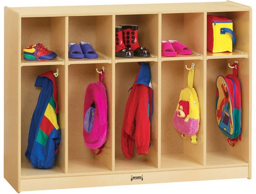

 
 

# Scribbly Cubby

A distributed caching service built on dotnet.  You know take stuff out and put stuff away.

## Table of Contents
1. [🎁 Example](#Example)

## Example

Below is a brief snip of code to get you started before reading more.
