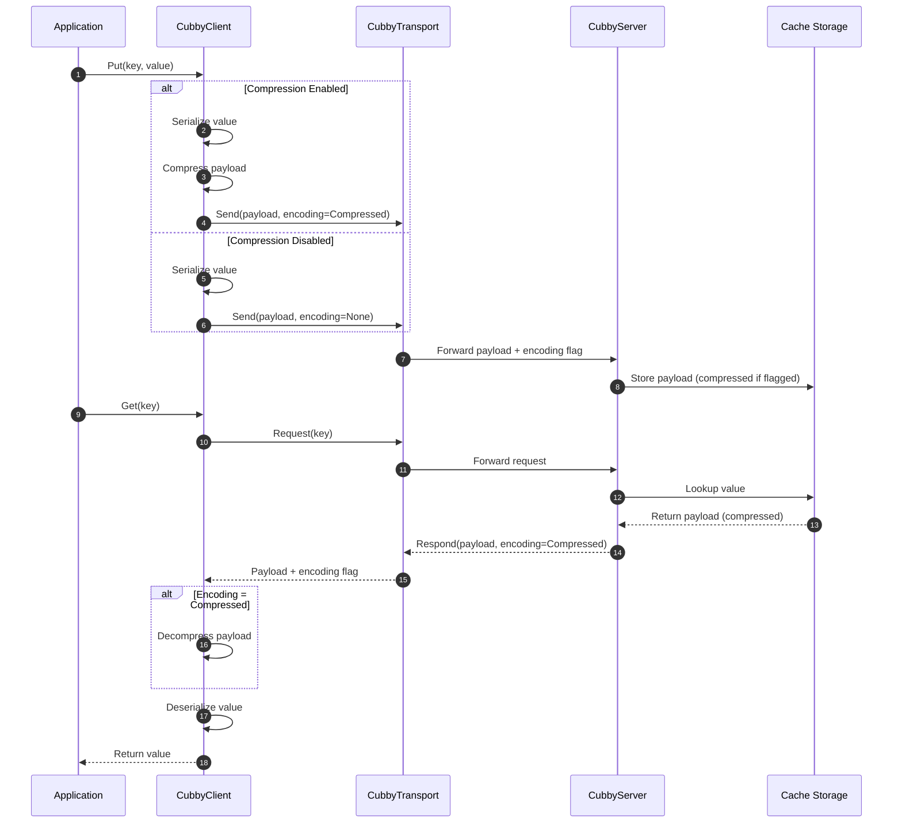

 
[](https://github.com/Scribbly-Fun/Scribbly.Cubby/issues)


 

[](https://github.com/Scribbly-Fun/Scribbly.Cubby/actions/workflows/dotnet-test.yml)


# Scribbly Cubby

Cubby is a 'choose your own adventure' cross platform native AOT .net distributed cache application. 

> [!Note]
> Still in initial development, there may be several incorrect statements in the readme


## Table of Contents
<!-- TOC -->
* [Scribbly Cubby](#scribbly-cubby)
  * [Table of Contents](#table-of-contents)
  * [Example](#example)
* [Cubby Host](#cubby-host)
  * [AOT](#aot)
  * [Library](#library)
  * [Docker](#docker)
  * [Transports](#transports)
    * [HTTP](#http)
    * [GRPC](#grpc)
    * [TCP](#tcp)
* [Cubby Client](#cubby-client)
  * [Transports](#transports-1)
    * [HTTP](#http-1)
    * [GRPC](#grpc-1)
    * [TCP](#tcp-1)
  * [Serializers](#serializers)
    * [System.Text.Json](#systemtextjson)
    * [MessagePack](#messagepack)
  * [Compression](#compression)
* [Benchmarks](#benchmarks)
    * [2025.12.20 Store Comparisons](#20251220-store-comparisons)
    * [K6 Load Tests](#k6-load-tests-)
<!-- TOC -->

## Example

Below is a brief snip of code to get you started before reading more.

# Cubby Host

The cubby host is a native AOT application that can be hosted on bare metal or containers.  Cubby host can also be used as a
nuget package and executed from within an existing application.  

## AOT

## Library

Add a package reference to `Scribbly.Cubby.Server` as well as a Transport package such as 
`Scribbly.Cubby.Grpc.Server` or `Scribbly.Cubby.Http.Server`

> [!Note]
> You can simply look at the source code for the Scribbly.Cubby.Host application for examples in the 
> /app/Scribbly.Cubby.Host/ directory

To get started some services need to be configured and registered.

```csharp
var builder = WebApplication.CreateSlimBuilder(args);

// Use our defaults
builder.AddCubbyServer();
```

*configure options*

```csharp
var builder = WebApplication.CreateSlimBuilder(args);

builder
    .AddCubbyServer(ops =>
    {
        // Cubby's default storage
        ops.Store = CubbyOptions.StoreType.RefStruct; 
        
        // When greater than zero a max cache key value will be set.  This is a large optimization if the value is known.
        ops.Capacity = int.MinValue;
        
        // Override the concurrency with a specific number of CORES
        ops.Cores = Environment.ProcessorCount;
    });
```

Once configured each transport may/will require some setup.

```csharp
builder
    .AddCubbyServer()
    .WithCubbyGrpcServer();
```

Lastly the application may need to bind the transport

```csharp
var builder = WebApplication.CreateSlimBuilder(args);

builder
    .AddCubbyServer()
    .WithCubbyGrpcServer();

var app = builder.Build();

app.MapCubbyGrpc();
```

## Docker

Simply pull our container using docker pull.

``docker pull scribbly/cubby:0.1.0-7-docker-file.2``

> [!Note]
> The container is still not GA and will be changing.
> Long term you will be able to start the container with the transport(s) specified using an environment variable
> something like: SCRB_TRANSPORT:tcp http grpc 
> Currently the container will start with gRPC and no https, this can create issues using a gRPC client.

## Transports

Cubby (will) support multiple transports configured in the hosted application or using environment variables.

### HTTP

### GRPC

### TCP

# Cubby Client


## Transports


### HTTP

### GRPC

### TCP

## Serializers

Cubby allows clients to create custom encoders or use pre-built serializers provided by cubby.

### System.Text.Json

By default cubby will use System.Text.Json to serialize all object as byte[] data.

*cubby implicitly uses System.Text.Json*

```csharp
builder.Services
    .AddCubbyClient()
    .WithCubbyGrpcClient();
```

*override and configure the serializer*

```csharp
builder.Services
    .AddCubbyClient(ops =>
    {
        ops.AddSystemTextSerializer();
    })
    .WithCubbyGrpcClient();
```

*extend and override our defaults*

```csharp
builder.Services
    .AddCubbyClient(ops =>
    {
        ops.AddSystemTextSerializer(ops =>
        {
            // Add type resolvers to ensure AOT compliance
            ops.TypeInfoResolverChain.Insert(0, ItemJsonContext.Default);
        });
    })
    .WithCubbyGrpcClient();
```

*configure a compression service*

```csharp

builder.Services
    .AddCubbyClient(ops =>
    {
        ops.AddSystemTextSerializer(
            optionsCallback: ops =>
            {
                ops.TypeInfoResolverChain.Insert(0, ItemJsonContext.Default);
            }, 
            compressor: new MyCompressor());
    })
    .WithCubbyGrpcClient();
```

### MessagePack

By adding a reference to the ``Scribbly.Cubby.MessagePack`` cubby con be configured to use `MessagePack` 
to serialize all objects.

https://github.com/MessagePack-CSharp/MessagePack-CSharp

*call the ``AddMessagePackSerializer()`` method to use message pack*

```csharp
builder.Services
    .AddCubbyClient(ops =>
    {
        ops.AddMessagePackSerializer();
    })
    .WithCubbyGrpcClient();
```

*override and configure the serializer*

```csharp

builder.Services
    .AddCubbyClient(ops =>
    {
        ops.AddMessagePackSerializer(ops =>
        {
            // See message pack docs
            ops.SequencePool.Clear();
        });
    })
    .WithCubbyGrpcClient();
```

> [!Note]
> When using MessagePack we will use their built-in compression as apposed to using the Cubby `ICubbyCompression` 

## Compression

The cubby client can optionally compress data befire transmitting the cache across the transport. 


# Benchmarks

### 2025.12.20 Store Comparisons

The initial benchmarks to help select a default starting point for a in-memory caching mechanism

| Method                          | Threads | EntryCount | Mean      | Error     | StdDev    | Median    | Ratio | RatioSD | Completed Work Items | Lock Contentions | Allocated | Alloc Ratio |
|-------------------------------- |-------- |----------- |----------:|----------:|----------:|----------:|------:|--------:|---------------------:|-----------------:|----------:|------------:|
| ConcurrentDictionary_Get        | 1       | 100000     |  7.297 ms | 0.7886 ms | 2.3004 ms |  6.601 ms |  1.08 |    0.45 |                    - |                - |   1.47 KB |        1.00 |
| ShardedConcurrentDictionary_Get | 1       | 100000     |  5.278 ms | 0.3443 ms | 0.9989 ms |  5.069 ms |  0.78 |    0.25 |                    - |                - |   1.47 KB |        1.00 |
| LockFreeHashTable_Get           | 1       | 100000     | 11.693 ms | 0.2281 ms | 0.4054 ms | 11.511 ms |  1.74 |    0.45 |                    - |                - |   1.47 KB |        1.00 |
|                                 |         |            |           |           |           |           |       |         |                      |                  |           |             |
| ConcurrentDictionary_Get        | 4       | 100000     |  2.206 ms | 0.1414 ms | 0.4170 ms |  2.053 ms |  1.03 |    0.26 |               3.0000 |                - |   2.05 KB |        1.00 |
| ShardedConcurrentDictionary_Get | 4       | 100000     |  1.415 ms | 0.0310 ms | 0.0895 ms |  1.389 ms |  0.66 |    0.12 |               3.0000 |                - |   2.05 KB |        1.00 |
| LockFreeHashTable_Get           | 4       | 100000     |  3.362 ms | 0.0420 ms | 0.0351 ms |  3.353 ms |  1.57 |    0.25 |               3.0000 |                - |   2.05 KB |        1.00 |
|                                 |         |            |           |           |           |           |       |         |                      |                  |           |             |
| ConcurrentDictionary_Get        | 8       | 100000     |  1.408 ms | 0.0275 ms | 0.0282 ms |  1.408 ms |  1.00 |    0.03 |               6.9277 |                - |   2.89 KB |        1.00 |
| ShardedConcurrentDictionary_Get | 8       | 100000     |  1.162 ms | 0.0232 ms | 0.0523 ms |  1.156 ms |  0.83 |    0.04 |               6.9922 |                - |    2.9 KB |        1.00 |
| LockFreeHashTable_Get           | 8       | 100000     |  1.608 ms | 0.0300 ms | 0.0368 ms |  1.608 ms |  1.14 |    0.03 |               6.9902 |                - |    2.9 KB |        1.00 |
|                                 |         |            |           |           |           |           |       |         |                      |                  |           |             |
| ConcurrentDictionary_Get        | 16      | 100000     |  1.501 ms | 0.0297 ms | 0.0542 ms |  1.491 ms |  1.00 |    0.05 |               7.8340 |                - |   3.82 KB |        1.00 |
| ShardedConcurrentDictionary_Get | 16      | 100000     |  1.302 ms | 0.0242 ms | 0.0526 ms |  1.290 ms |  0.87 |    0.05 |               7.9316 |                - |   3.72 KB |        0.97 |
| LockFreeHashTable_Get           | 16      | 100000     |  1.678 ms | 0.0327 ms | 0.0350 ms |  1.679 ms |  1.12 |    0.05 |               7.8438 |                - |   3.62 KB |        0.95 |

### K6 Load Tests 

>[!Warning]
> Disclaimer, some of the benchmarks comparing HTTP in docker vs Native AOT HTTP may not be accurate as the request doesn't have the same network topology.
> Take these with a grain of salt.  As you can see the Native execution is way faster.  I'll need to stand up a real server to get some real numbers.


