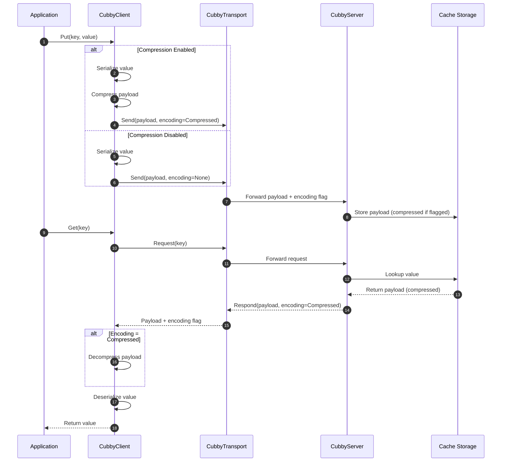

 
[](https://github.com/Scribbly-Fun/Scribbly.Cubby/issues)


 

[](https://github.com/Scribbly-Fun/Scribbly.Cubby/actions/workflows/dotnet-test.yml)


# Scribbly Cubby

Cubby is a 'choose your own adventure' cross platform native AOT .net distributed cache application. 

> [!Note]
> Still in initial development, there may be several incorrect statements in the readme


## Table of Contents
<!-- TOC -->
* [Cubby Host](#cubby-host)
  * [AOT](#aot)
  * [Library](#library)
  * [Docker](#docker)
  * [Transports](#transports)
* [Cubby Client](#cubby-client)
  * [Transports](#transports-1)
  * [Serializers](#serializers)
  * [Compression](#compression)
* [Cache Store](#cache-store)
* [Benchmarks](#benchmarks)
<!-- TOC -->

## Example

Below is a brief snip of code to get you started before reading more.

# Cubby Host

The cubby host is a native AOT application that can be hosted on bare metal or containers.  Cubby host can also be used as a
nuget package and executed from within an existing application.  

## AOT

To create a Native AOT build of cubby follow the build steps below.

```shell
cd ./app/Scribbly.Cubby.Host
```

```shell
dotnet publish ./Scribbly.Cubby.Host.csproj -r win-x64 -c Release -o ../../artifacts/publish
```
```shell
../../artifacts/publish/Scribbly.Cubby.Host.exe
```

>[!Note]
> Compiled binaries for a few platforms (Window x64, Linux x64) will be provided eventually.
> Expect to see these on the github releases soon.

## Docker

Simply pull our container using docker pull.  By default the container will run with the Cubby HTTP and gPRC transports.

``docker pull scribbly/cubby:***``

### Environment Variable

> [!Note]
> Long term you will be able to start the container with the transport(s) specified using an environment variable
> something like: CUBBY__TRANSPORT:tcp http grpc
> Currently the container will start with gRPC and HTTP transports.
> gRPC will not include a SSL will need to be managed from outside the container

| Name                     | Purpose                                                  | Values                                                 | 
|--------------------------|----------------------------------------------------------|--------------------------------------------------------|
| CUBBY__STORE             | Changes the cubby internal store                         | Sharded, Concurrent, LockFree                          |
| CUBBY__CAPACITY          | Sets the storage capacity for the cache                  | 0 - None or 1 - XXXX                                   |
| CUBBY__CLEANUP__STRATEGY | Sets the cache expiration cleanup strategy               | Disabled, Hourly, Random, Aggressive, Duration, Manual |
| CUBBY__CLEANUP__DELAY    | The time between cleanups when using a Duration strategy | 00:00:00 - HH:MM:SS:MS                                 |
| LOGGING__LOGLEVEL        | A log level used for all standard out messages           | Scribbly.Cubby : Trace, Information, etc               |

**Default Container Configuration**

| Name                     | Value                        | 
|--------------------------|------------------------------|
| CUBBY__STORE             | Sharded                      |
| CUBBY__CAPACITY          | 0 - None                     |
| CUBBY__CLEANUP__STRATEGY | Random                       |
| CUBBY__CLEANUP__DELAY    | 00:00:00 / NA                |
| LOGGING__LOGLEVEL        | Scribbly.Cubby : Information |

## Library

Add a package reference to `Scribbly.Cubby.Server` as well as a Transport package such as 
`Scribbly.Cubby.Grpc.Server` or `Scribbly.Cubby.Http.Server`

> [!Note]
> You can simply look at the source code for the Scribbly.Cubby.Host application for examples in the 
> /app/Scribbly.Cubby.Host/ directory
> 
> Take note of the use of CreateSlimBuilder to support AOT.  
> You can use whatever you need however, it may maintain AOT compatability.

To get started some services need to be configured and registered.

```csharp
var builder = WebApplication.CreateSlimBuilder(args);

// Use our defaults
builder.AddCubbyServer();
```

*configure options*

```csharp
var builder = WebApplication.CreateSlimBuilder(args);

builder
    .AddCubbyServer(ops =>
    {
        // Cubby's default storage
        ops.Store = CubbyOptions.StoreType.Sharded; 
        
        // When greater than zero a max cache key value will be set.  This is a large optimization if the value is known.
        ops.Capacity = 0;
        
        // Override the concurrency with a specific number of CORES
        ops.Cores = Environment.ProcessorCount;
        
        // Configure an async cleanup strategy
        ops.Cleanup.Strategy = CacheCleanupOptions.AsyncStrategy.Random;
    });
```

Once configured at a minimum a transport must be configured. Each transport may/will require some setup.

*grpc transport*

```csharp
builder
    .AddCubbyServer()
    .WithCubbyGrpcServer();
```

*http transport*

```csharp
builder
    .AddCubbyServer()
    .WithCubbyHttpServer();
```

Lastly the application may need to bind the transport

```csharp
var builder = WebApplication.CreateSlimBuilder(args);

builder
    .AddCubbyServer()
    .WithCubbyGrpcServer();

var app = builder.Build();

app.MapCubbyGrpc();
```

*Note that multiple transports can be used at once*

```csharp
var builder = WebApplication.CreateSlimBuilder(args);

builder
    .AddCubbyServer()
    .WithCubbyHttpServer()
    .WithCubbyGrpcServer();

var app = builder.Build();

app.MapCubbyGrpc();
app.MapCubbyHttp();
```

### Cubby Options

All builder configuration can be both hardcoded (as above) or added to your appsettings.json.
Cubby will load the hard coded values then override them with values from your configuration.
Below is an example appsettings.json

```json
{
  "Logging": {
    "LogLevel": {
      "Scribbly.Cubby": "Information"
    }
  },
  "Cubby": {
    "Store" : "Sharded",
    "Capacity": 1000,
    "Cleanup": {
      "Strategy": "Duration",
      "Delay" : "00:00:01"
    }
  }
}
```

All asynchronous executions monitoring changes in the Cubby configuration.  
As such your async strategy and durations can be updated while the application is running.

## Transports

Cubby supports multiple transports configured in the hosted application or using environment variables.

### HTTP

### GRPC

### TCP

`(TDB)`

# Cubby Client

Similar to the server Cubby has several client side library designed to seamlessly interface with the transports.
You just need to be sure your server is running the transport designed to operate with your client.

To start using the `Cubby Client` add a package reference to a Cubby Client transport

1. Scribbly.Cubby.Grpc.Client
2. Scribbly.Cubby.Http.Client

In your applications program use the ``AddCubbyClient`` service extension to register all required services.

```csharp
builder.Services
    .AddCubbyClient();
```

At a minimum at least one transport must be setup

```csharp
builder.Services
    .AddCubbyClient()
    .WithCubbyHttpClient();
```

Several client options and configuration may be required depending on your use case and environment

```csharp
builder.Services
    .AddCubbyClient(ops =>
    {
        // Set the server's URL 
        var host = Environment.GetEnvironmentVariable("SCRB_CUBBY_HTTPS") ?? Environment.GetEnvironmentVariable("SCRB_CUBBY_HTTP");
        ops.Host = new Uri(host?? throw new InvalidOperationException());
        
        // Configure the client scope, defaults to a Singleton
        ops.Lifetime = ServiceLifetime.Singleton;
        
        // Setup a custom serializer configuration
        ops.AddSystemTextSerializer(ops =>
        {
            ops.TypeInfoResolverChain.Insert(0, ItemJsonContext.Default);
        });
    })
    .WithCubbyHttpClient()
    .WithCubbyGrpcClient();
```

All transports support custom HTTP handlers using the HTTP Client Factory

```csharp
builder.Services
    .AddCubbyClient(ops =>
    {
        // ...
    })
    .WithCubbyHttpClient(ops =>
    {
        ops.AddHttpMessageHandler<MyHandler>()
    })
    .WithCubbyGrpcClient(ops =>
    {
        ops.AddHttpMessageHandler<MyHandler>()
    });
```

Once the cubby client is all configured for your application you can resolve the ``ICubbyClient`` service.

```csharp
app.MapPost("cubby/client/{key}", async (ICubbyClient cache, string key, Item item, CancellationToken token) =>
{
    return await cache.PutObject(key, item, CacheEntryOptions.None, token);
});

app.MapGet("cubby/client/{key}", async (ICubbyClient cache, string key, CancellationToken token) =>
{
    return await cache.GetObject<Item>(key, token);
});
```

Cubby also supports Microsoft's `IDistributedCache`

```csharp
app.MapPost("/entry/{key}", (IDistributedCache cache, string key, [FromBody] Item item) =>
{
    var value = JsonSerializer.SerializeToUtf8Bytes(item);
    cache.Set(key, value);
});
```

## Transports

When using multiple transports you may need to explicitly select the designed ``ICubbyClient``.  Note that the `ICubbyClient`
will resolve to the first transport added to your application.

### HTTP

To explicitly use the Http Transport resolve the ``IHttpCubbyClient``

```csharp
app.MapPost("cubby/http/{key}", async (IHttpCubbyClient cache, string key, [FromQuery] bool? compress, [FromBody] Item item, CancellationToken token) =>
{
    return await cache.PutObject(
        key, item, 
        compress is true 
            ? CacheEntryOptions.Never(CacheEntryFlags.Compressed) 
            : CacheEntryOptions.None, 
        token);
});

app.MapGet("cubby/http/{key}", async (IHttpCubbyClient cache, string key, CancellationToken token) =>
{
    return await cache.GetObject<Item>(key, token);
});

```
### GRPC

To explicitly use the gRPC Transport resolve the ``IGrpcCubbyClient``

```csharp
```csharp
app.MapPost("cubby/grpc/{key}", async (IGrpcCubbyClient cache, string key, [FromBody] Item item, CancellationToken token) =>
{
    return await cache.PutObject(key, item, CacheEntryOptions.None, token);
});

app.MapGet("cubby/grpc/{key}", async (IGrpcCubbyClient cache, string key, CancellationToken token) =>
{
    return await cache.GetObject<Item>(key, token);
});

```

### TCP

``(TBD)``

## Serializers

Cubby allows clients to create custom encoders or use pre-built serializers provided by cubby.

### System.Text.Json

By default cubby will use System.Text.Json to serialize all object as byte[] data.

*cubby implicitly uses System.Text.Json*

```csharp
builder.Services
    .AddCubbyClient()
    .WithCubbyGrpcClient();
```

*override and configure the serializer*

```csharp
builder.Services
    .AddCubbyClient(ops =>
    {
        ops.AddSystemTextSerializer();
    })
    .WithCubbyGrpcClient();
```

*extend and override our defaults*

```csharp
builder.Services
    .AddCubbyClient(ops =>
    {
        ops.AddSystemTextSerializer(ops =>
        {
            // Add type resolvers to ensure AOT compliance
            ops.TypeInfoResolverChain.Insert(0, ItemJsonContext.Default);
        });
    })
    .WithCubbyGrpcClient();
```

*configure a compression service*

```csharp

builder.Services
    .AddCubbyClient(ops =>
    {
        ops.AddSystemTextSerializer(
            optionsCallback: ops =>
            {
                ops.TypeInfoResolverChain.Insert(0, ItemJsonContext.Default);
            }, 
            compressor: new MyCompressor());
    })
    .WithCubbyGrpcClient();
```

### MessagePack

By adding a reference to the ``Scribbly.Cubby.MessagePack`` cubby can be configured to use `MessagePack` 
to serialize all objects.  Ensure you've generated a TypeShapeProvider for each time you plan to serialize.

https://aarnott.github.io/Nerdbank.MessagePack/index.html

*call the ``AddMessagePackSerializer()`` method to use message pack*

```csharp
builder.Services
    .AddCubbyClient(ops =>
    {
        ops.AddMessagePackSerializer(Witness.GeneratedTypeShapeProvider);
    })
    .WithCubbyGrpcClient();
```

*override and configure the serializer*

## Compression

The cubby client can optionally compress data before transmitting the cache across the transport. 



# Cache Store

### Eviction Strategies

The below diagram describes Cubby's eviction logic.

> [!Note]
> The async background process can be configured and will exit each query when locking contention is detected.


# Benchmarks

### 2025.12.20 Store Comparisons

The initial benchmarks to help select a default starting point for a in-memory caching mechanism

| Method                          | Threads | EntryCount | Mean      | Error     | StdDev    | Median    | Ratio | RatioSD | Completed Work Items | Lock Contentions | Allocated | Alloc Ratio |
|-------------------------------- |-------- |----------- |----------:|----------:|----------:|----------:|------:|--------:|---------------------:|-----------------:|----------:|------------:|
| ConcurrentDictionary_Get        | 1       | 100000     |  7.297 ms | 0.7886 ms | 2.3004 ms |  6.601 ms |  1.08 |    0.45 |                    - |                - |   1.47 KB |        1.00 |
| ShardedConcurrentDictionary_Get | 1       | 100000     |  5.278 ms | 0.3443 ms | 0.9989 ms |  5.069 ms |  0.78 |    0.25 |                    - |                - |   1.47 KB |        1.00 |
| LockFreeHashTable_Get           | 1       | 100000     | 11.693 ms | 0.2281 ms | 0.4054 ms | 11.511 ms |  1.74 |    0.45 |                    - |                - |   1.47 KB |        1.00 |
|                                 |         |            |           |           |           |           |       |         |                      |                  |           |             |
| ConcurrentDictionary_Get        | 4       | 100000     |  2.206 ms | 0.1414 ms | 0.4170 ms |  2.053 ms |  1.03 |    0.26 |               3.0000 |                - |   2.05 KB |        1.00 |
| ShardedConcurrentDictionary_Get | 4       | 100000     |  1.415 ms | 0.0310 ms | 0.0895 ms |  1.389 ms |  0.66 |    0.12 |               3.0000 |                - |   2.05 KB |        1.00 |
| LockFreeHashTable_Get           | 4       | 100000     |  3.362 ms | 0.0420 ms | 0.0351 ms |  3.353 ms |  1.57 |    0.25 |               3.0000 |                - |   2.05 KB |        1.00 |
|                                 |         |            |           |           |           |           |       |         |                      |                  |           |             |
| ConcurrentDictionary_Get        | 8       | 100000     |  1.408 ms | 0.0275 ms | 0.0282 ms |  1.408 ms |  1.00 |    0.03 |               6.9277 |                - |   2.89 KB |        1.00 |
| ShardedConcurrentDictionary_Get | 8       | 100000     |  1.162 ms | 0.0232 ms | 0.0523 ms |  1.156 ms |  0.83 |    0.04 |               6.9922 |                - |    2.9 KB |        1.00 |
| LockFreeHashTable_Get           | 8       | 100000     |  1.608 ms | 0.0300 ms | 0.0368 ms |  1.608 ms |  1.14 |    0.03 |               6.9902 |                - |    2.9 KB |        1.00 |
|                                 |         |            |           |           |           |           |       |         |                      |                  |           |             |
| ConcurrentDictionary_Get        | 16      | 100000     |  1.501 ms | 0.0297 ms | 0.0542 ms |  1.491 ms |  1.00 |    0.05 |               7.8340 |                - |   3.82 KB |        1.00 |
| ShardedConcurrentDictionary_Get | 16      | 100000     |  1.302 ms | 0.0242 ms | 0.0526 ms |  1.290 ms |  0.87 |    0.05 |               7.9316 |                - |   3.72 KB |        0.97 |
| LockFreeHashTable_Get           | 16      | 100000     |  1.678 ms | 0.0327 ms | 0.0350 ms |  1.679 ms |  1.12 |    0.05 |               7.8438 |                - |   3.62 KB |        0.95 |

### K6 Load Tests 

>[!Warning]
> Disclaimer, some of the benchmarks comparing HTTP in docker vs Native AOT HTTP may not be accurate as the request doesn't have the same network topology.
> Take these with a grain of salt.  As you can see the Native execution is way faster.  I'll need to stand up a real server to get some real numbers.


